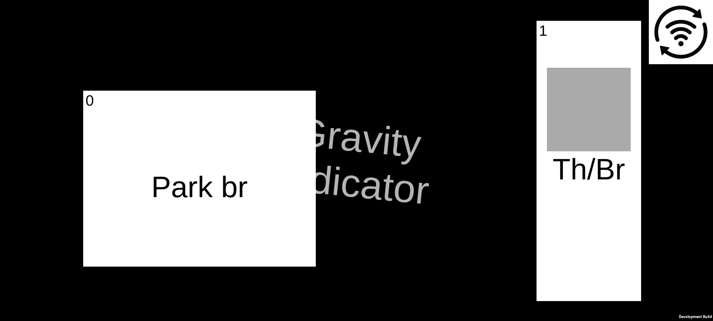
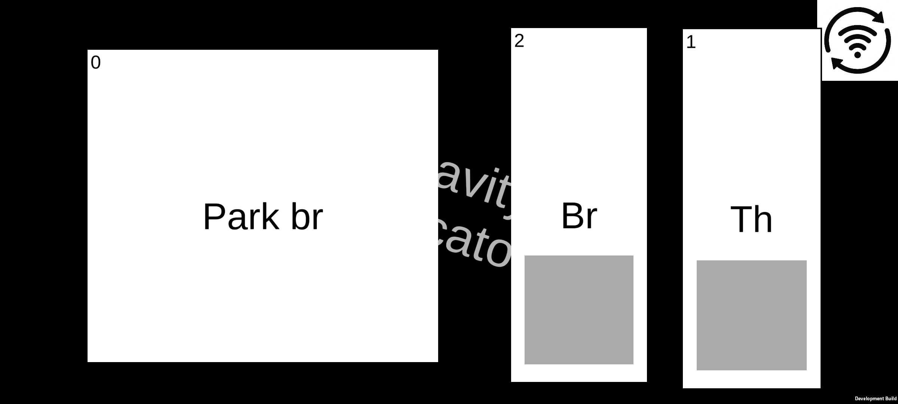

# BeamNG RemoteControlUltra
Port and upgrade of [BeamNG.drive Remote Control](https://github.com/BeamNG/remotecontrol)  
  
The game won't work if it isn't patched, you can use the [Patcher](https://github.com/BitcoderCZ/BeamNG_RemoteControlPatcher) I made for this purpose  
  
This is an independent creation and is not affiliated, associated, authorized, endorsed by, or in any way officially connected with BeamNG GmbH, the creators of BeamNG.drive  

# New features
- Custom controls layout - buttons and axes, enable/disable "gravity" axis
- Reconnect button

# Screenshots

